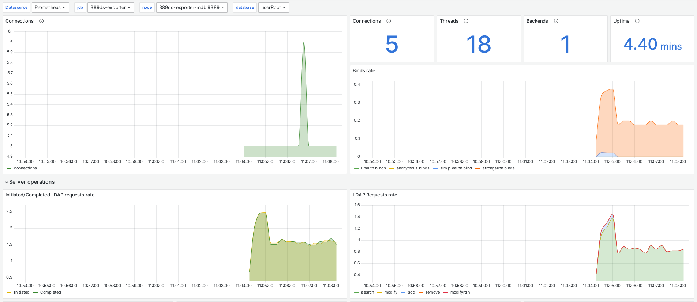

# 389-ds-exporter

A Prometheus exporter for 389-ds that collects metrics over the LDAP protocol and exposes them in Prometheus format.



## Features
- Collects metrics from LDAP entry attributes in various formats
- Counts subordinates of LDAP entries
- Configurable via YAML configuration file
- Supports 389-ds version 2.3 and higher
- Supports Berkeley DB and LMDB backends of the 389-ds server

## Quick Start

### Build from Source

Requirements:

- Go >= 1.24.3
- make

```bash
# Clone project repository
git clone git@github.com:vectinx/389-ds-exporter.git
cd 389-ds-exporter

# Build the 389-ds-exporter binary
make build
```

### Run with Docker

Pull the Docker image
```bash
docker pull vectinx/389-ds-exporter
```

Prepare the configuration file according to the [documentation](docs/config.md). Then run the container and pass it the generated config:
```bash
docker run -d --name 389-ds-exporter \
    -v $PWD/config.yml:/etc/config.yml:ro \
    -p 9389:9389 vectinx/389-ds-exporter \
    --config /etc/config.yml
```

To test the exporter:
```bash
curl localhost:9389/metrics
```

If something goes wrong, check the logs:
```bash
docker logs 389-ds-exporter
```


## Command-Line Interface

The command-line interface is self-documented and available via the `-h` (`--help`) option:
```bash
bash$ 389-ds-exporter --help
usage: 389-ds-exporter [<flags>]

Flags:
  -h, --[no-]help            Show context-sensitive help (also try --help-long and --help-man).
      --config="config.yml"  Path to configuration file
      --[no-]check-config    Check current configuration and print it to stdout
      --[no-]version         Show application version.
```

## Example

To see the 389-ds-exporter in action, you can refer to the examples:
```bash
cd examples
docker-compose up -d
```

After that, go to the `http://localhost:3000` address in your browser and wait until the infrastructure initialization is complete.

##  Based on

This project is inspired and **partially based on** the open-source project **[389DS‑exporter](https://github.com/ozgurcd/389DS-exporter)** by **[ozgurcd](https://github.com/ozgurcd)** (MIT Licensed). Although most of the codebase has been significantly rewritten or replaced, the original project served as an architectural and conceptual starting point. The original code remains available here:

https://github.com/ozgurcd/389DS-exporter

Please see the `LICENSE` file for details.

##  License

This project is licensed under the [MIT License](./LICENSE).