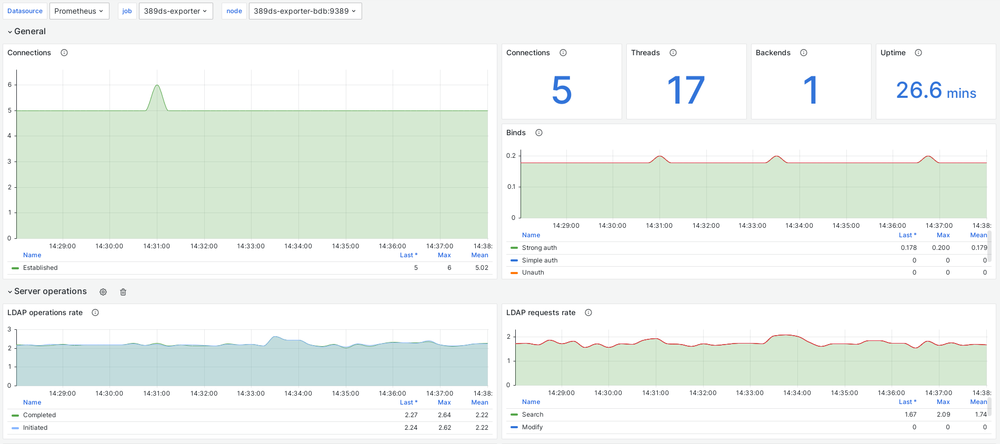

# 389-ds-exporter

Экспортер Prometheus для 389-ds, собирающий метрики по протоколу LDAP



## Возможности
- Более 80 метрик с сервера 389-ds
- Поддержка 389-ds версии 2.3 и выше
- Поддержка бэкендов Berkeley DB и LMDB сервера 389-ds
- Минимальная нагрузка на LDAP-каталог за счёт переиспользования соединений через пул LDAP
- Настройка через YAML-конфигурацию
- В комплекте готовый дашборд

## Быстрый старт

### Сборка из исходников

Требования:

- Go >= 1.24.3
- make

```bash
# Клонируем репозиторий
git clone git@github.com:vectinx/389-ds-exporter.git
cd 389-ds-exporter

# Собираем бинарник 389-ds-exporter
make build

# Собираем docker-образ
make docker
```

### Запуск через Docker

Скачиваем Docker-образ
```bash
docker pull vectinx/389-ds-exporter
```

Подготавливаем конфигурационный файл согласно [документации](docs/config.md).
Запускаем контейнер, передав ему сгенерированный конфиг:
```bash
docker run -d --name 389-ds-exporter \
    -v $PWD/config.yml:/etc/config.yml:ro \
    -p 9389:9389 vectinx/389-ds-exporter \
    --config /etc/config.yml
```

Для проверки экспортера:
```bash
curl localhost:9389/metrics
```

Если что-то пошло не так, смотрим логи:
```bash
docker logs 389-ds-exporter
```

## Интерфейс командной строки

CLI самодокументирован и доступен через опцию `-h` (`--help`):
```bash
389-ds-exporter --help
usage: 389-ds-exporter [<flags>]

Flags:
  -h, --[no-]help            Show context-sensitive help (also try --help-long and --help-man).
      --config="config.yml"  Path to configuration file
      --[no-]check-config    Validate the current configuration and print it to stdout
      --[no-]version         Show application version.
```

## Пример

Чтобы увидеть 389-ds-exporter в действии, можно использовать примеры:
```bash
cd examples
docker-compose up -d
```

Затем откройте `http://localhost:3000` в браузере и дождитесь окончания инициализации инфраструктуры.

## Основано на

Проект вдохновлён и **частично основан на** открытом проекте **[389DS‑exporter](https://github.com/ozgurcd/389DS-exporter)** от **[ozgurcd](https://github.com/ozgurcd)** (MIT License).
Хотя большая часть кода была существенно переписана или заменена, исходный проект послужил архитектурной и концептуальной основой.
Оригинальный код доступен здесь:

https://github.com/ozgurcd/389DS-exporter

Подробнее см. файл `LICENSE`.

## Лицензия

Проект лицензирован под [MIT License](./LICENSE).
